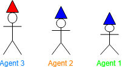
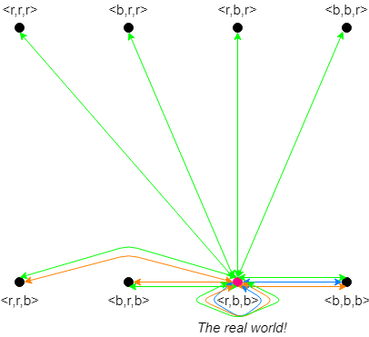
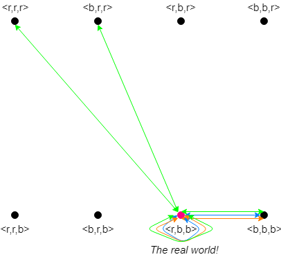
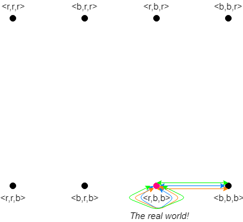
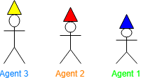
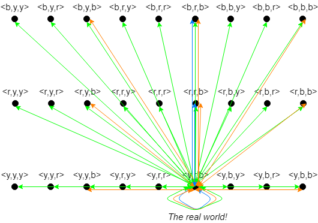
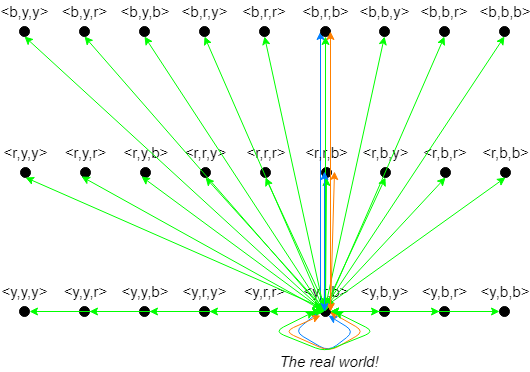
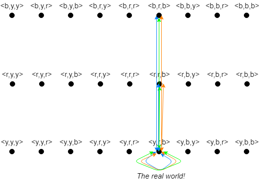

```{r setup, include=FALSE}
knitr::opts_chunk$set(echo = TRUE)
```


# Description of the riddle


<font face="apple chancery" color="olive"><center><i>You and other individuals have been captured by super-intelligent aliens! The aliens think agents look quite tasty, but luckily for you, their civilization forbids eating highly logical and cooperative beings. They are not sure whether you qualify, so they decide to give you all a test to figure that out. 
The aliens tell you the following:</i> </center></font>


<p><center> "You will be placed in a line, facing forward and ordered from <i>tallest</i> to <i>shortest</i>. You will not be able to look behind you or step out of line. <br>
Each of you will have either a <span style="color:blue">blue</span> or a <span style="color: red">red</span> hat, assigned randomly and no one will be told how many of each colour there are. When I tell you to begin, each of you must guess the colour of your hat, starting from the person in the back and moving down the line.
Don't even think to say words other than <span style="color:blue">blue</span> or <span style="color: red">red</span> or signal something with intonation for instance. <br><i><b>Else, you will all be eaten immediately! </b></i> 
<br>If you make at most one mistake, you will be spared. You are given a couple of minutes to discuss a strategy before we start!"</center></p>


<!--<font color="olive"><center><i>Can you think of a strategy guaranteed to save everyone?</i> </center></font>
-->

# Strategy

The strategy to win this game and be freed by the aliens is to agree that the tallest agent says:
<ul>
<li> <span style="color:blue">Blue</span> to indicate that he sees an odd number of <span style="color:red">red</span> hats in front of him.</li>
<li><span style="color:red">Red</span> to indicate that he sees an even number of <span style="color:red">red</span> hats in front of him. </li>
</ul>

The tallest agents does not hear any information from another agent before he has to speak, thus he cannot be entirely sure about his hat colour. Therefore, he can only guess his hat color. However, this is not a big problem, since the aliens allowed the agents to make one mistake. All other agents can say with full certainty which colour their hat is. Hence, there will not be made more than 1 mistake by the group. Namely, on the basis of hearing the previous answer(s) and seeing the hats in front of him, each agent can update his knowledge and determine his own hat colour. 

The game's goal is to have as many of the agents correctly guess their hat colour. The game is successfully played if at most one mistake is made. Therefore, using the technique mentioned above, the game is always played successfully, since only the tallest agent is unsure.

<!--When the first agent has answered, the common knowledge of the others gets immediately adjusted. The number of possible worlds decrements when the previous agent(s) has indicated whether he sees an odd or even number of blue hats in front of him. Combining previous answers with an agent's current..  
-->

# Implementation

To solve the riddle we built a system that is run from the command line. At the beginning, the system will ask the user whether (s)he would like to read the descirption of the riddle or not. Next, the user can select the amount of agents (at least two) and whether or not to assign a hat colour for each agent. In case the user does not want to manually input a hat colour, these will be assigned randomly. The system will then show the distribution of <span style="color:red">red</span> and <span style="color:blue">blue</span> hats. 

Each agent is created from a class ```Agent()``` which stores the agent number, the colour of the hat and the number of hats in front of him. The main programme contains the dialogues with the user and a several functions. The function ```assignRandomHat``` and ```assignUserHat``` assign a random hat colour or the colour input by the user, respectively. When the hats are assigned, the programme shows how those are distributed among the agents.

The kripke model is created from a class ```Kripke()``` which stores the agents and the possible worlds. This class has a method called ```createKripkeModel``` which creates the initial kripke model (i.e. before any announcement is made) in the form of a dictionary. Each agent is the dictionary key and the values of each key representes the worlds accessible for the agent before any announcemenet is made. The function takes all possible worlds, created with the ```itertools``` package and the hat distribution chosen (stored in ```hats```). For each agent ```hats```is sliced so that it contains only the hats that each agent sees. For each world ```w``` this is also sliced so that it contains only the hats that are in front of the agent. The two subarrays are then compared and only if they are equal they are added to the possible worlds of the agent. In other words, only the words representing what the agent sees are added. 

Next the system enters the ```announcementLoop()``` in which each agent makes an announcement. After each announcement, the system stores whatever has been announced into an array called ```commonKnowledge``` which will be used later to update the Kripke model. After the first announcement is made, the knowledge of all the agents (except the tallest one) is upadated by eliminating either all the worlds containing an even number of red hats (if the tallest agent said 'blue') or an odd number of red hats (if the tallest agent said 'red'). After the knowledge is updated, the agent next in line deduces the colour of his hat. This is done in the ```deduceHatColour```, in which an agent checks if his hat colour is the same in all updated worlds. If this case, he announces it. This new announcement is added to the common knowledge array. In the next iteration, the agent next in line (the third agent) will eliminate all the worlds in his current knowledge in which the second agent does not wear the hat with the colour announced previousely. This process of eliminating worlds continues for all subsequent agents until all agent have made announcement. 
During the announcement loop, the user has the option to view the updated Kripke model or not. 

When the announcement loop terminates, a function called ```checkRiddle()``` checks if at most one mistake has been made. This is done by comparing the ```commonKnowledge``` with the hat distribution input at the very begginig of the riddle. The comparison is done with ```numpy.sum```, which outputs the number of dissimilar items in two array. If the correct strategy was implemented, this comparison should never output more than one dissimilar item.

In the end, the system outputs a friendly message such as: ""Wow you are a highly intelligence specie, you will not be eaten!". 

A programme that solves this riddle can be found [here](https://github.com/LuciaBaldassini/MAS).

# Analysis

Depending on the number of agents and the hat colours assigned to each of them, there are multiple different scenarios possible. 
As an example, we will elaborate on the possible worlds in which three agents are participating in total. Each of the agents is either wearing a <span style="color: red">red</span> or <span style="color:blue">blue</span> hat.The following table indicates the 8 different scenarios that are possible in this situation. The arrows visualize the direction the particular agent is looking at and the color of the cell represents the agent's hat colour. 

<table class="tg">
<caption><i>Table 1: The 8 different scenarios possible for 3 agents</i></caption>
<tbody>
<tr>
<th bgcolor="FFEFD5"><center><font color="black">Scenarios</font></center></th>
<th bgcolor="FFEFD5"><center><font color="black">Agent 3</font></center></th>
<th bgcolor="FFEFD5"><center><font color="black">Agent 2</font></center></th>
<th bgcolor="FFEFD5"><center><font color="black">Agent 1</font></center></th>
</tr>
<tr><td bgcolor="FFEFD5"><center><font color="black">1</font></center><br></td>
<td bgcolor="FF0000"><b><center><b><font color="white">=></font></b></center></b></td>
<td bgcolor="FF0000"><b><center><b><font color="white">=></font></b></center></b></td>
<td bgcolor="FF0000"><b><center><b><font color="white">=></font></b></center></b></td></tr>

<tr><td bgcolor="FFEFD5"><center><font color="black">2</font></center><br></td>
<td bgcolor="FF0000"><b><center><b><font color="white">=></font></font></b></center></b></td>
<td bgcolor="FF0000"><b><center><b><font color="white">=></font></b></center></b></td>
<td bgcolor="0000FF"><b><center><b><font color="white">=></font></b></center></b></td>
</tr>

<tr><td bgcolor="FFEFD5"><center><font color="black">3</font></center><br></td>
<td bgcolor="FF0000"><b><center><b><font color="white">=></font></b></center></b></td>
<td bgcolor="0000FF"><b><center><b><font color="white">=></font></b></center></b></td>
<td bgcolor="FF0000"><b><center><b><font color="white">=></font></b></center></b></td></tr>

<tr><td bgcolor="FFEFD5"><center><font color="black">4</font></center><br></td>
<td bgcolor="FF0000"><b><center><b><font color="white">=></font></b></center></b></td>
<td bgcolor="0000FF"><b><center><b><font color="white">=></font></b></center></b></td>
<td bgcolor="0000FF"><b><center><b><font color="white">=></font></b></center></b></td></tr>

<tr><td bgcolor="FFEFD5"><center><font color="black">5</font></center><br></td>
<td bgcolor="0000FF"><b><center><b><font color="white">=></font></b></center></b></td>
<td bgcolor="0000FF"><b><center><b><font color="white">=></font></b></center></b></td>
<td bgcolor="0000FF"><b><center><b><font color="white">=></font></b></center></b></td></tr>

<tr><td bgcolor="FFEFD5"><center><font color="black">6</font></center><br></td>
<td bgcolor="0000FF"><b><center><b><font color="white">=></font></b></center></b></td>
<td bgcolor="0000FF"><b><center><b><font color="white">=></font></b></center></b></td>
<td bgcolor="FF0000"><b><center><b><font color="white">=></font></b></center></b></td></tr>

<tr><td bgcolor="FFEFD5"><center><font color="black">7</font></center><br></td>
<td bgcolor="0000FF"><b><center><b><font color="white">=></font></b></center></b></td>
<td bgcolor="FF0000"><b><center><b><font color="white">=></font></b></center></b></td>
<td bgcolor="0000FF"><b><center><b><font color="white">=></font></b></center></b></td></tr>

<tr><td bgcolor="FFEFD5"><center><font color="black">8</font></center><br></td>
<td bgcolor="0000FF"><b><center><b><font color="white">=></font></b></center></b></td>
<td bgcolor="FF0000"><b><center><b><font color="white">=></font></b></center></b></td>
<td bgcolor="FF0000"><b><center><b><font color="white">=></font></b></center></b></td></tr>
</tbody>
</table>


### Example Analysis Scenario 4
In order to analyze the problem, we will present an example and go through all the agents' announcements and the changes to the Kripke model. This way, we can explore how the knowledge of the agents change. 

In our example, <span style="color:#00FF00">Agent 1</span> (the smallest agent) will be wearing a <span style="color:blue">blue</span> hat. <span style="color:#FF8000">Agent 2</span> (the middle agent) will also be wearing a <span style="color:blue">blue</span> hat. <span style="color:#007FFF">Agent 3</span> (the tallest agent) will be wearing a <span style="color:red">red</span> hat. 

```{r prisoners, echo=FALSE, out.width = '100%', fig.align='center'}

```

Initially, we could draw the following Kripke model: <span style="color:#007FFF">Agent 3</span> is unsure of only the colour of his own hat. The knowledge of <span style="color:#FF8000">Agent 2</span> contains worlds in which both his and  <span style="color:#007FFF">Agent 3</span>'s hat colour vary. The knowledge of <span style="color:#00FF00">Agent 1</span> contains all possible combinations of <span style="color:blue">blue</span> and <span style="color:red">red</span>.   

```{r model no relations, echo=FALSE, out.width = '100%', fig.align='center'}

```

Firstly, <span style="color:#007FFF">Agent 3</span> will announce <span style="color:red">red</span> to indicate that he sees an even number of <span style="color:red">red</span> hats (namely, 0). After the announcement, <span style="color:#FF8000">Agent 2</span> sees a <span style="color:blue">blue</span> hat in front of him so he eliminates all the worlds in which he is wearing a <span style="color:red">red</span> hat. In fact, it is not possible for him to wear a 
<span style="color:red">red</span> because, in this case, the tallest agent would have announced an odd number of red hats. Since this did not happen, <span style="color:#FF8000">Agent 2</span> deduces that his hat colour is <span style="color:blue">blue</span> and correctly announces it. 
<span style="color:#00FF00">Agent 1</span> also knows that there is an even number of <span style="color:red">red</span> hats, so he eliminates all the worlds in which himself and <span style="color:#FF8000">Agent 2</span> are wearing different hat colours. In other words, he only keeps the worlds in which himself and <span style="color:#FF8000">Agent 2</span> are wearing the same hat colour (either <span style="color:blue">blue</span> or <span style="color:red">red</span>).

Hence, the Kripke model is updated to: 


```{r model after 3, echo=FALSE, out.width = '100%', fig.align='center'}

```

<span style="color:#FF8000">Agent 2</span> announced that the colour of his hat is <span style="color:blue">blue</span>. Because of this announcement, <span style="color:#00FF00">Agent 1</span> now eliminates all the worlds in which <span style="color:#FF8000">Agent 2</span> is wearing a <span style="color:red">red</span> hat. 

The Kripke model is updated to: 

```{r model after 3 and 2, echo=FALSE, out.width = '100%', fig.align='center'}

```

Because <span style="color:#00FF00">Agent 1</span> knows that there is an even number of <span style="color:red">red</span> hats (from the first announcement) and that <span style="color:#FF8000">Agent 2</span> is wearing a <span style="color:blue">blue</span> hat (from the second announcement), he concludes that in the real worlds there are 0 <span style="color:red">red</span> hats and he announces that the colour of its own hat is <span style="color:blue">blue</span>, solving the riddle.  

</div>

# Further implementation

An addition made to the system is the scenario where there are 10 hats (actually, the number of hats is irrelevant but it was specified as such), with 3 colours (<span style="color:red">red</span>, <span style="color:blue">blue</span> and <span style="color:yellow">yellow</span>) and a bug in the room. In this scenario, our first strategy will not work as specifying whether there is an odd or an even number of red hats will not guarentee that any of the agents will guess their colour correctly. To add to the difficulty, a bug is added to the room where the prisoners can discuss strategy, such that if they all agree to say red such that one third of them will probably guess correctly, the captors can give none of the prisoners red hats. 

The winning strategy is called the "checksum modulo-3" method. The prisoners agree on different numbers to represent each colour har, for example: <span style="color:yellow">yellow</span> = 0, <span style="color:blue">blue</span> = 1 and <span style="color:red">red</span> = 2. Using these numbers, the tallest agents adds up the numbers of the colour he or she sees and performs a modulo of 3 on the sum, therefore obtaining either number 0, 1 or 2 and he or she will then utter the corresponding colour. In order to avoid negative numbers, all agents start with the number 30 and add the number corresponding to the colour uttered by the tallest agent to what is called the "running tally". The next agent also calculates the sum of the hats in front of him or her, and subtracts this number from the running tally and then performs a modulo of 3, such that they end up with their own colour hat. The next agents again subtract this number from the current running tally such that when it is their turn, they all correctly call out the colour of their hat. 

As this method is hard to imagine, we will provide a short example of three agents, such that we can also visualize the Kripke model. In this new scenario, <span style="color:#007FFF">Agent 3</span> is wearing a <span style="color:yellow">yellow</span> hat, <span style="color:#FF8000">Agent 2</span> is wearing a <span style="color:red">red</span> hat and <span style="color:#00FF00">Agent 1</span> is wearing a <span style="color:blue">blue</span> hat. 

```{r prisoners, echo=FALSE, out.width = '100%', fig.align='center'}

```

Initially, we could draw the following Kripke model: <span style="color:#007FFF">Agent 3</span> is unsure of only the colour of his own hat. The knowledge of <span style="color:#FF8000">Agent 2</span> contains worlds in which both his and  <span style="color:#007FFF">Agent 3</span>'s hat colour vary. The knowledge of <span style="color:#00FF00">Agent 1</span> contains all possible combinations of <span style="color:yellow">yellow</span>, <span style="color:blue">blue</span> and <span style="color:red">red</span>. 

```{r model no relations, echo=FALSE, out.width = '100%', fig.align='center'}

```

In this scenario, <span style="color:#007FFF">Agent 3</span> can see one <span style="color:red">red</span> hat (=2) and one <span style="color:blue">blue</span> hat (=1), he calculates the sum (2+1=3) and performs a modulo (3%3=0), he ends up with 0 which represents <span style="color:yellow">yellow</span>, he therefore calls out "<span style="color:yellow">yellow</span>". 

<span style="color:#FF8000">Agent 2</span> adds this number (0) to the previously mentioned 30, resulting in 30. He sees a <span style="color:blue">blue</span> hat and therefore subtracts the corresponding number from the running tally (30-1=29) and performs a modulo 3 (29%3=2), he ends up with 2 which represents <span style="color:red">red</span>, he therefore says "span style="color:red">red</span>" which is correct. Before the utterance of <span style="color:#FF8000">Agent 2</span>, <span style="color:#00FF00">Agent 1</span> actually could not update its Kripke model, therefore after the first utterance by <span style="color:#007FFF">Agent 3</span> the Kripkse model is updated to:

```{r model after 3, echo=FALSE, out.width = '100%', fig.align='center'}

```

<span style="color:#00FF00">Agent 1</span> also updated its running tally after the call by <span style="color:#007FFF">Agent 3</span>, which is 30 at this point. After the utterance of <span style="color:#FF8000">Agent 2</span> this updates to (30-2=28) and he or she then performs a modulo (28%3=1) to conclude that he or she is wearing a <span style="color:blue">blue</span> hat. This results in the final Kripke model:
 
```{r model after 3, echo=FALSE, out.width = '100%', fig.align='center'}

```
