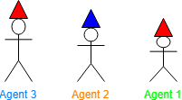
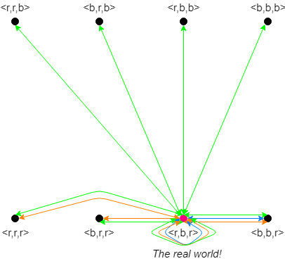
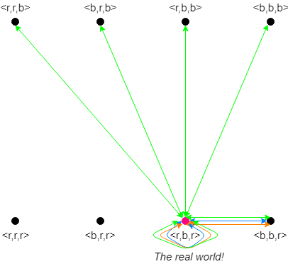
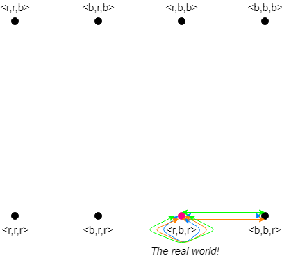
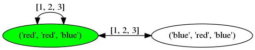

```{r setup, include=FALSE}
knitr::opts_chunk$set(echo = TRUE)
```


# Introduction

For our project we were interested in analysing riddles involving agents wearing different hats color. In this type of riddles, agents wear a hat, usually assigned randomly, and have to guess their hat color. These riddles are perfect for applying Kripke models and Public Annnouncement Logic. After each agent makes an announcement, the accessible worlds of the following agents are reduced so that agents become sure about their hat because in all worlds accessible to them they all wear the same color. 
In our porject we analysed two riddles, which will be briefly explained below. For one of the two riddles, two strategies are implemented. 

The 'Strategy' section shows the strategies used to solve both riddles. In the 'Analysis' section we provide, for each riddle and each strategy, a practical example in which Kripke models and Public Announcement Logic is directly applied. The 'Implementation' section provides a description of how the strategies where implemented in the programme. Lastly, in the 'Conclusion and further improvements' we provide a brief discussion of the project and possibilities for further improvements.

## Description riddle 1


You and other individuals have been captured by super-intelligent aliens! The aliens think agents look quite tasty, but - luckily for you - their civilization forbids eating highly logical and cooperative beings. Since the aliens are not sure whether you qualify, they decide to give you all a test to figure that out. The aliens tell you the following:


<p><center> "You will be placed in a line, facing forward and ordered from <i>tallest</i> to <i>shortest</i>. You will not be able to look behind you or step out of the line. <br>
Each of you will have either a <span style="color:blue">blue</span> or a <span style="color: red">red</span> hat (assigned randomly) and no one will be told how many of each colour hats there are. When I tell you to begin, each of you must guess the colour of their own hat, starting from the person in the back and moving down the line.
Know that we notice everything! So, do not even think of saying other words than <span style="color:blue">blue</span> or <span style="color: red">red</span> or signal something with intonation, for instance. <br><i><b>Else, you will all be eaten immediately! </b></i> 
<br>For you to stay spared, you are allowed to make up to one mistake at most. You are given a couple of minutes to discuss a strategy before we start."</center></p>

##  Description riddle 1: variation

In a variation of this riddle, the prisoners are not allowed to make any mistakes, but are allowed to pass their turn. However, they are not all allowed to always pass so at least one prisoner should correctly guess the colour of their hat. This variation involves an entirely different strategy, which will be described in the "Strategies" section.

## Description riddle 2

You and other individuals are part of a tv show in which you can win a lot of money! The host of the show tells you the following:

<p><center> "You will be placed in a line, facing forward and ordered from <i>tallest</i> to <i>shortest</i>. You will not be able to look behind you or step out of the line. <br>
Each of you will have either a <span style="color:red">red</span>, a <span style="color:blue">blue</span> or a <span style="color:yellow">yellow</span> hat (assigned randomly). When the game begins, each of you must guess the colour of their own hat, starting from the person in the back and moving down the line. Your final prize will be determined by the amount of correct guesses you make. You get 10.000$ for each correct guess! You have 5 minutes to come up with a solution."</center></p>
 
# Strategies

## Riddle 1: first strategy

The strategy to win this game and, hence, be freed by the aliens is to agree that the tallest agent says:
<ul>
<li> <span style="color:blue">"Blue"</span> to indicate that he sees an odd number of <span style="color:red">red</span> hats in front of him;</li>
<li><span style="color:red">"Red"</span> to indicate that he sees an even number of <span style="color:red">red</span> hats in front of him. </li>
</ul>

The tallest agents does not hear any information from another agent before he has to speak. Since he cannot be entirely sure about his own hat colour, he has to guess. This is not immediately a big problem, since the aliens allowed the agents to make one mistake. Since all other agents can say with full certainty which colour their hat is, there will not be made more than one mistake in total by the group. Namely, on the basis of hearing the previous answer(s) and seeing the hats in front of them, each agent can update his beliefs and determine his own hat colour. 

The game's goal is to have as many of the agents correctly guess their hat colour. The game is successfully played if at most one mistake is made. Therefore, since only the tallest agent is unsure of his answer, the game is always played successfully if the above-mentioned technique is applied.

## Riddle 1: second strategy
In the variation of riddle 1 we need to apply a different strategy compared to the one explained before, as the tallest agent cannot afford to make a wrong guess to convey the odd or even number of hats. The strategy to win is the following for the first agent agents:
<ul>
<li><span style="color:blue">"Blue"</span> to indicate that all agents in front of him are wearing a <span style="color:red">red</span> hat. </li>
<li>"Pass", otherwise.</li>
</ul>

The strategy is the following for the other agents agents:
<ul>
<li><span style="color:blue">"Blue"</span> if all agents in front of him are wearing a <span style="color:red">red</span> hat and all agents before him passed. </li>
<li><span style="color:red">"Red"</span> if an agent before him said either <span style="color:red">"red"</span> or <span style="color:blue">"blue"</span>.</li>
<li>"Pass" otherwise.</li>
</ul>

This strategy works in every sequence of hats where there is a <span style="color:red">"red"</span> hat followed by only <span style="color:blue">"blue"</span> hats, even if only the shortest agent has a <span style="color:red">"red"</span> hat. The only case that this strategy fails, is when all agents are wearing a <span style="color:blue">"blue"</span> hat and so the first agent, according to this strategy, says <span style="color:red">"red"</span>. However, this only occurs in very few cases, especially with a large number of agents (for example: 1/1024 cases for 10 agents) and is therefore safer to use than the first strategy.

## Riddle 2

In this scenario, applying for example the first strategy of riddle 1 will not help, since specifying whether there is an odd or even number of red hats will not guarentee that any of the agents guesses their hat colour correctly. To add to the difficulty, a bug is added to the room in which the prisoners discuss their strategy together. For instance, if the prisoners agree on the strategy to all answer with the word <span style="color:red">red</span> (entailing that probably one third of them will have guessed correctly), the captors can sabotage them (e.g. giving none of the prisoners a red hat, so everyone guesses incorrectly).

The winning strategy is called the "checksum modulo-3" method. The prisoners agree on different numbers to represent each hat colour. For example: <span style="color:yellow">yellow</span> = 0, <span style="color:blue">blue</span> = 1 and <span style="color:red">red</span> = 2. Using these numbers, the  agents add up the numbers of the colours they see and perform a modulo (%) of 3 on the sum. Hence, obtaining either number 0, 1 or 2 and the corresponding colour will be the word he utters. In order to avoid negative numbers, all agents start with the number 30 and add the number, corresponding to the colour uttered by the taller agent(s), to what is called the "running tally". The next agent also calculates the sum of the hats in front of him, subtracts this number from the running tally and then performs a modulo of 3, such that they end up with their own hat colour number. The following agents again subtract this number from the current running tally such that when it is their turn, they all correctly call out the colour of their hat. 

# Analysis

## Riddle 1
Depending on the number of agents and the hat colours assigned to each of them, there are multiple different scenarios possible. 
As an example, we will elaborate on the possible worlds in which three agents are participating in total. Each of the agents is either wearing a <span style="color: red">red</span> or <span style="color:blue">blue</span> hat. The following table indicates the 8 different scenarios that are possible in this situation. The arrows visualize the direction in which the particular agent is looking. T he colour of the cell represents the agent's hat colour. 

<table class="tg">
<caption><i>Table 1: The 8 different scenarios possible for 3 agents</i></caption>
<tbody>
<tr>
<th bgcolor="FFEFD5"><center><font color="black">Scenarios</font></center></th>
<th bgcolor="FFEFD5"><center><font color="black">Agent 3</font></center></th>
<th bgcolor="FFEFD5"><center><font color="black">Agent 2</font></center></th>
<th bgcolor="FFEFD5"><center><font color="black">Agent 1</font></center></th>
</tr>
<tr><td bgcolor="FFEFD5"><center><font color="black">1</font></center><br></td>
<td bgcolor="FF0000"><b><center><b><font color="white">=></font></b></center></b></td>
<td bgcolor="FF0000"><b><center><b><font color="white">=></font></b></center></b></td>
<td bgcolor="FF0000"><b><center><b><font color="white">=></font></b></center></b></td></tr>

<tr><td bgcolor="FFEFD5"><center><font color="black">2</font></center><br></td>
<td bgcolor="FF0000"><b><center><b><font color="white">=></font></font></b></center></b></td>
<td bgcolor="FF0000"><b><center><b><font color="white">=></font></b></center></b></td>
<td bgcolor="0000FF"><b><center><b><font color="white">=></font></b></center></b></td>
</tr>

<tr><td bgcolor="FFEFD5"><center><font color="black">3</font></center><br></td>
<td bgcolor="FF0000"><b><center><b><font color="white">=></font></b></center></b></td>
<td bgcolor="0000FF"><b><center><b><font color="white">=></font></b></center></b></td>
<td bgcolor="FF0000"><b><center><b><font color="white">=></font></b></center></b></td></tr>

<tr><td bgcolor="FFEFD5"><center><font color="black">4</font></center><br></td>
<td bgcolor="FF0000"><b><center><b><font color="white">=></font></b></center></b></td>
<td bgcolor="0000FF"><b><center><b><font color="white">=></font></b></center></b></td>
<td bgcolor="0000FF"><b><center><b><font color="white">=></font></b></center></b></td></tr>

<tr><td bgcolor="FFEFD5"><center><font color="black">5</font></center><br></td>
<td bgcolor="0000FF"><b><center><b><font color="white">=></font></b></center></b></td>
<td bgcolor="0000FF"><b><center><b><font color="white">=></font></b></center></b></td>
<td bgcolor="0000FF"><b><center><b><font color="white">=></font></b></center></b></td></tr>

<tr><td bgcolor="FFEFD5"><center><font color="black">6</font></center><br></td>
<td bgcolor="0000FF"><b><center><b><font color="white">=></font></b></center></b></td>
<td bgcolor="0000FF"><b><center><b><font color="white">=></font></b></center></b></td>
<td bgcolor="FF0000"><b><center><b><font color="white">=></font></b></center></b></td></tr>

<tr><td bgcolor="FFEFD5"><center><font color="black">7</font></center><br></td>
<td bgcolor="0000FF"><b><center><b><font color="white">=></font></b></center></b></td>
<td bgcolor="FF0000"><b><center><b><font color="white">=></font></b></center></b></td>
<td bgcolor="0000FF"><b><center><b><font color="white">=></font></b></center></b></td></tr>

<tr><td bgcolor="FFEFD5"><center><font color="black">8</font></center><br></td>
<td bgcolor="0000FF"><b><center><b><font color="white">=></font></b></center></b></td>
<td bgcolor="FF0000"><b><center><b><font color="white">=></font></b></center></b></td>
<td bgcolor="FF0000"><b><center><b><font color="white">=></font></b></center></b></td></tr>
</tbody>
</table>


### Example Analysis Scenario 4 using strategy 1
In order to analyze the problem, we will present an example and go through all the agents' announcements and the changes to the Kripke model. This way, we can explore how the worlds accessible for each agent change. 

In our example, <span style="color:#00FF00">Agent 1</span> (the smallest agent) will be wearing a <span style="color:blue">blue</span> hat. <span style="color:#FF8000">Agent 2</span> (the middle agent) will also be wearing a <span style="color:blue">blue</span> hat. <span style="color:#007FFF">Agent 3</span> (the tallest agent) will be wearing a <span style="color:red">red</span> hat. 

```{r prisoners, echo=FALSE, out.width = '100%', fig.align='center'}
knitr::include_graphics("pictures/Prisoners_rbb.png")
```

Initially, we could draw the following Kripke model: <span style="color:#007FFF">Agent 3</span> is unsure of only the colour of his own hat. The knowledge of <span style="color:#FF8000">Agent 2</span> contains worlds in which both his and <span style="color:#007FFF">Agent 3</span>'s hat colour vary. The knowledge of <span style="color:#00FF00">Agent 1</span> contains all possible combinations of <span style="color:blue">blue</span> and <span style="color:red">red</span>.   

```{r model no relations, echo=FALSE, out.width = '100%', fig.align='center'}
knitr::include_graphics("pictures/hats_rbb_agent3,2,1.png")
```

Firstly, <span style="color:#007FFF">Agent 3</span> will announce <span style="color:red">red</span> to indicate that he sees an even number of <span style="color:red">red</span> hats (namely, 0). After the announcement, <span style="color:#FF8000">Agent 2</span> sees a <span style="color:blue">blue</span> hat in front of him so he eliminates all the worlds in which he is wearing a <span style="color:red">red</span> hat. In fact, it is not possible for him to wear a 
<span style="color:red">red</span> because, in this case, the tallest agent would have announced an odd number of red hats. Since this did not happen, <span style="color:#FF8000">Agent 2</span> deduces that his hat colour is <span style="color:blue">blue</span> and correctly announces it. In formal terms, the formula that <span style="color:#FF8000">Agent 2</span> uses to update the Kripke model is: [red]'there is an even number of red hats'. 

<span style="color:#00FF00">Agent 1</span> also knows that there is an even number of <span style="color:red">red</span> hats, so he performs the same updates as <span style="color:#FF8000">Agent 2</span> and eliminates all worlds in which there is an odd number of <span style="color:red">red</span> hats. The update of <span style="color:#00FF00">Agent 1</span> is: [red] 'there is an even number of red hats'.

Hence, the Kripke model is updated to: 


```{r model after 3, echo=FALSE, out.width = '100%', fig.align='center'}
knitr::include_graphics("pictures/hats_rbb_after3.png")
```

<span style="color:#FF8000">Agent 2</span> announced that the colour of his hat is <span style="color:blue">blue</span>. Because of this announcement, <span style="color:#00FF00">Agent 1</span> updates the Kripke model with the formula [blue]'Agent 2 is wearing blue'
and eliminates all the worlds in which <span style="color:#FF8000">Agent 2</span> is wearing a <span style="color:red">red</span> hat. 

The Kripke model is updated to: 

```{r model after 3 and 2, echo=FALSE, out.width = '100%', fig.align='center'}
knitr::include_graphics("pictures/hats_rbb_after3,2.png")
```

Because <span style="color:#00FF00">Agent 1</span> knows that there is an even number of <span style="color:red">red</span> hats (from the first announcement) and that <span style="color:#FF8000">Agent 2</span> is wearing a <span style="color:blue">blue</span> hat (from the second announcement), he concludes that in the real world there are 0 <span style="color:red">red</span> hats and he announces that the colour of his own hat is <span style="color:blue">blue</span>, solving the riddle.  

### Example Analysis Scenario 3 using strategy 2

For the second strategy, we will look at scenario 3. In this example, <span style="color:#00FF00">Agent 1</span> (the smallest agent) will be wearing a <span style="color:red">red</span> hat. <span style="color:#FF8000">Agent 2</span> (the middle agent) will be wearing a <span style="color:blue">blue</span> hat. <span style="color:#007FFF">Agent 3</span> (the tallest agent) will be wearing a <span style="color:red">red</span> hat. 

```{r, echo=FALSE, out.width = '100%', fig.align='center'}

```


Initially, we can draw a Kripke model similar to strategy 1: <span style="color:#007FFF">Agent 3</span> is unsure of only the colour of his own hat. The worlds accessible for <span style="color:#FF8000">Agent 2</span> are those in which both his and <span style="color:#007FFF">Agent 3</span>'s hat colour vary. The worlds accessible for <span style="color:#00FF00">Agent 1</span> are all possible combinations of <span style="color:blue">blue</span> and <span style="color:red">red</span> of length 3 (the number of agents). 

```{r, echo=FALSE, out.width = '100%', fig.align='center'}

```

Note the similarity to the initial Kripke model in strategy 1. The difference is that the worlds where <span style="color:#00FF00">Agent 1</span> is wearing a <span style="color:blue">blue</span> hat and a <span style="color:red">red</span> hat are swapped (for strategy one the <span style="color:blue">blue</span> hats are at the bottom, the strategy 2 they are at the top.)

Now, according to the strategy, <span style="color:#007FFF">Agent 3</span> will pass its turn as (s)he does not see only <span style="color:red">red</span> hats. This announcement already decreases the possible worlds for <span style="color:#00FF00">Agent 1</span> and <span style="color:#FF8000">Agent 2</span>. Both agents perform the following update of the Kripke model [pass]'Agent 2 and Agent 1 are not wearing a red hat' and elimnate those worlds.

The Kripke model is updated to:

```{r, echo=FALSE, out.width = '100%', fig.align='center'}

```

Now, <span style="color:#FF8000">Agent 2</span> can say with certainty that their hat colour is <span style="color:blue">blue</span> and announces this. Now, <span style="color:#00FF00">Agent 1</span> realizes that their hat colour must be <span style="color:red">red</span>, because if the hat of <span style="color:#FF8000">Agent 2</span> had been <span style="color:blue">blue</span> he would have passed his turn. He update the Kripke model with the formula [blue]'Agent 1 is wearing a red hat' and elimnates all the worlds in which he is wearing a <span style="color:blue">blue</span> hat.  

The final Kripke model again looks familiar: 

```{r, echo=FALSE, out.width = '100%', fig.align='center'}

```

## Riddle 2


As the "checksum modulo-3" method might be hard to imagine, we will provide a brief example of three agents, such that we can also visualize the Kripke model. In this new scenario, <span style="color:#007FFF">Agent 3</span> is wearing a <span style="color:yellow">yellow</span> hat, <span style="color:#FF8000">Agent 2</span> is wearing a <span style="color:red">red</span> hat and <span style="color:#00FF00">Agent 1</span> is wearing a <span style="color:blue">blue</span> hat. 

```{r, echo=FALSE, out.width = '100%', fig.align='center'}
knitr::include_graphics("pictures/Prisoners_yrb.png")
```

Initially, we could draw the following Kripke model: <span style="color:#007FFF">Agent 3</span> is unsure of only the colour of his own hat. The worlds accessible for <span style="color:#FF8000">Agent 2</span> contain worlds in which both his and  <span style="color:#007FFF">Agent 3</span>'s hat colour vary. The worlds accessible for <span style="color:#00FF00">Agent 1</span> contains all possible combinations of <span style="color:yellow">yellow</span>, <span style="color:blue">blue</span> and <span style="color:red">red</span> of length 3. 

```{r, echo=FALSE, out.width = '100%', fig.align='center'}
knitr::include_graphics("pictures/hats_yrb_agent3,2,1.png")
```

In this scenario, <span style="color:#007FFF">Agent 3</span> can see one <span style="color:red">red</span> hat (=2) and one <span style="color:blue">blue</span> hat (=1). He calculates the sum (2+1=3) and performs a modulo (3%3=0). He ends up with 0, which represents <span style="color:yellow">yellow</span>. Therefore, he says "<span style="color:yellow">yellow</span>". 

<span style="color:#FF8000">Agent 2</span> adds the code of the hat color that was just announced (namely 0) to the previously mentioned 30, resulting in 30. As he sees a <span style="color:blue">blue</span> hat, he subtracts the corresponding number from the running tally (30-1=29) and performs a modulo 3 (29%3=2), ending up with value 2. This means <span style="color:#FF8000">Agent 2</span> will, correctly, say <span style="color:red">red</span>". He thus update the worlds accessible to him with the formula [yellow]'Agent 2 is wearing a red hat'.  Before the utterance of <span style="color:#FF8000">Agent 2</span>, there was nothing for <span style="color:#00FF00">Agent 1</span> to update his Kripke model with. Therefore, after the first utterance of <span style="color:#007FFF">Agent 3</span>, the Kripke model is updated to:

```{r, echo=FALSE, out.width = '100%', fig.align='center'}
knitr::include_graphics("pictures/hats_yrb_after3.png")
```

<span style="color:#00FF00">Agent 1</span> also updated its running tally after <span style="color:#007FFF">Agent 3</span>'s turn, which is 30 at this point. After the utterance of <span style="color:#FF8000">Agent 2</span>, the value is adjusted to 1 after subtraction and applying the modulo of 3 to the value ((30-2)%3=1). The Kripke model is updated with: [red]'Agent1 is wearing blue'. This results in the final Kripke model:
 

```{r, echo=FALSE, out.width = '100%', fig.align='center'}
knitr::include_graphics("pictures/hats_yrb_after3,2.png")
```

# Implementation

The programme that solves this riddle can be found [here](https://github.com/LuciaBaldassini/MAS). 

The programme is written in ```Python3``` and requires the packages ```numpy``` and ```pygraphviz```. The programme contains the following files: ```run.py``` which is used to run the programme, ```riddle1.py```and ```riddle2``` which contain the functions that implement riddle 1 and riddle 2 respecively, ```Agent.py``` which contains the agent class and ```utiliy.py``` which contains the functions common to both riddles. 

When the user runs the programme, a description of both riddle 1 and riddle 2 is shown. The system then asks which riddle the user wants to choose. Regardless of which riddle is chosen, a description of the implemented strategies is shown to the user. If riddle 1 is selected, the user has the option to solve it with two different strategies. 
In both riddles, the user selects the amount of agents, although a minimum of three agents is required. This is because riddle 2 requires at least three agents and riddle 1 becomes too trivial if less than three agents are used. Although there is no maximum, we advice the user to choose at most 10 agents to prevent the system from becoming too slow. Each agent is created from the class ```Agent()```, which stores the agent id (the shortest agent is agent number 1, and the id increases up to the tallest agent), the colour of his/her hat and the color of the hats in front of him/her.

The user has also the opportunity to either manually assign the hat colours of each agent or assign the color randomly (this is automatically done by the system with the function ```assignRandomHat```).  An overview of the distribution of the hats among the agents is then displayed.

## Riddle 1: strategy 1

First the initial Kripke model is created which contains all the worlds accessible by each agent **before** any announcement is made. This is done with the function ```createAgentKnowledge```. The model is in the form of a python dictionary in which the keys contain t he agent id and the values contain the accessbile worlds. The shortest agent is the one with the highest number of accessible worlds: The worlds accessible for him/her are all combinations of blue and red of length *n*, where *n* represents the number of agents in the riddle. For the other agents, the accessible worlds are those containing the hat color of the agents they see and all possible combinations of colors for the agents behind them. 

Next, the system enters the ```announcementLoop()``` in which each agent makes an announcement. Each announcement is stored into an array called ```commonKnowledge```, which will be used later to update the Kripke model. After the first announcement is made, the worlds accessible for each agent (except the tallest one) is updated with the function ```updateKripkeModel()``` so that all worlds containing an even number of red hats (if the tallest agent said <span style="color: blue">'blue'</span>) or an odd number of red hats (if the tallest agent said <span style="color: red">'red'</span>) are eliminated. The next agent in line, the second tallest agent, deduces the colour of his hat by checking if his/her hat colour is the same in all worlds currently accessible. If so, (s)he announces it and the new announcement is added to the common knowledge array. In the next iteration, the Kripke model of the remaining agents is updated by first eliminating all worlds in which the agent that just spoke wears a different hat color than the one announced and then by deleting again all worlds that contain an even or odd number of red hats, according to what the tallest agent announced. The agent next in line deduce the hat color using the same strategy as before. This continues in a loop until all agents have spoken.

After each agent has made an announcement, the user can decide to view the update Kripke model. In this case, a graph of the (updated) Krike model is created and saved in the same folder as the programme. The graph is created with ```graphviz``` and shows the real world in green, the other worlds in white and the edge labels represent the agent id (for example the label *2* represents agent 2). When many agents are used, due to the high number of worlds that need to be drawn, the function might output a warning such as 'Too many nodes' and the graph might failed to be correctly saved. That is anothe reason why we advice the user to choose a maximum number of agents of about 10. The figure below shows an example of a graph generated by the programme.

```{r, echo=FALSE, out.width = '100%', fig.align='center',fig.cap='Example of Kripke model generated by the programme'}

```

When the announcement loop terminates, a function called ```checkRiddle()``` checks if at most one mistake has been made. This is done by comparing the ```commonKnowledge``` with the hat distribution input at the very beginning of the riddle. The comparison is done with ```numpy.sum```, which outputs the number of dissimilar items of two arrays. If the correct strategy had been implemented, this comparison should never output more than one dissimilar item. In the end, the system outputs a friendly message such as: ""Wow you are a highly intelligence specie, you will not be eaten!". 

## Riddle 1: strategy 2

As it was the case with strategy 1, the initial Kripke model is created in the same way as before. The announcement loop starts again and the tallest agent announces either *blue* or *pass* according to the strategy explained in the Strategy section. The Kripke model for each agent is updated in the following way. First, if the tallest agent announced *blue*, all worlds are removed except the one in which all but the tallest agent are wearing a red hat. On the contrary, if the tallest agent passed, the world that was kept in the previous case is eliminated instead. The agent next in line, looks at all his/her accessible worlds: If in all cases (s)he is wearing the same hat color, she announces it, otherwise (s)he passed. The Kripke model is updated again in two ways, which follow directly from the strategy explained before. 
* If some agents before him/her has announced a color, all worlds in which (s)he is wearing a blue hat are eliminated.
* If all agents before him/her have passed and (s)he sees nothing but red hats, all worlds in wich (s)he is wearing a red hat are eliminated.
As previousely, the user has the option to inspect the updated Kripke model after each announcement.

Again the agent looks at all his/her accessible worlds after the update and annouces either a color or *pass*. This continues in a loop until all agents have spoken.

When the loop terminates, the function ```checkRiddle()``` checks if a mistake is made and if all agent have passed. In these cases, the system outputs a message informing the user that all agents will be eaten. 

## Riddle 2

As in the case of Riddle 1, the initial Kripke model is created in the same way as before. We also defined a dictionary in which each hat color is associated to a number, as it was explained in the Strategy section. This dictionary is used throughout the programme to map colors to number and viceversa. We also declared an initial tally of 30: we used this number because it was the one used in the description of the riddle but any multiples of 3 coud have been used.

The announcement loop starts again: the tallest agent calculates the checksum of the hats in front with the function ```calculateCheckSum```. This function loops over the hats that each agent sees and sum the corresponding numbers. The agent calculates the color of his/her own hat by taking the checksum and performing modulo 3 division. The color announced by the agent is added to the common knowledge and it is subtracted from the running tally. After the first announcement the Kripke model is updated in the following way. The agent next in line (the second tallest) calculates his/her hat colors by calculating the checksum, subtracting it from the running tally and performing the modulo 3 division. All the worlds in which that agent is not wearing the hat coloe (s)he has calculated are eliminated. The announcement is then added to the common knowledge. As previousey, the announcement loop continues until all agents have spoken.

At the end of the loop, a function calculates the final prize by multiplying the number of hats that were guessed correctly by 10000.  

# Conclusion and future implementations
In this project we showed how Kripke models and Public Announcement Logic can be used to analyse riddles. Any riddle which involves announcement made by agents can be analysed in a similar way as the riddles presented. 

Riddle 1 was a clear example of how agents can reason about the worlds accessible to them to come up with the right conclusion. Riddle 2 was perhaps a less blatant example, since agents needed to only apply a formula to deduce the hat color. However, a correct guess was only possible thanks to the announncement of the previous agent, thus we decided to include that as well. We thought it was interesting to include two strategies of the same riddle to show that there actually many possible ways in which a riddle can be solved. The first strategy was the most optimal one, in which everyone was guaranteed survival in every possible scenario. We though it was interesting to also include one which failed in one scenario. It was also interesting to include this second strategy because agents were allowed to pass and not just guess a hat color. We thought that having some variation in our programme would make the user experience more pleasant.

Unfortunately, due to time contraints, there is still room for improvements. For example, a nice user interface could be wrapped around the programme. At the early stages of our project we though of developing our programme as a phone application. However, the time at our disposal was not much so we decided to make it a command line programme. Of course this is at the expense of a nice graphics which will make the user experience more enjoable. 
Secondly, it would have been nice to include other types of riddles (not just hat riddles) that also uses Public Announcement Logic. In this way, we could have shown that Public Announcement Logic cam be applied to a wide variaty of riddles. Moreover, it would have been nice to let the user decide his/her own stratey. The programme coould have then dinamically updated the kripke models according to the user strategy. We leave those ideas as a strarting points for future projects. 

</div>